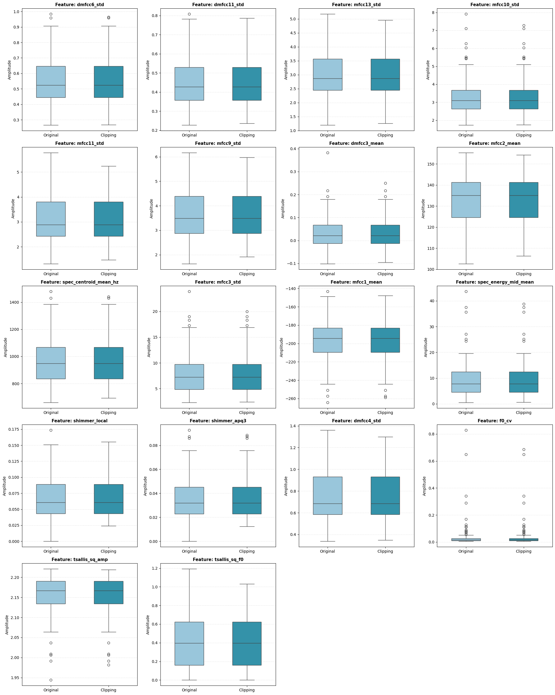
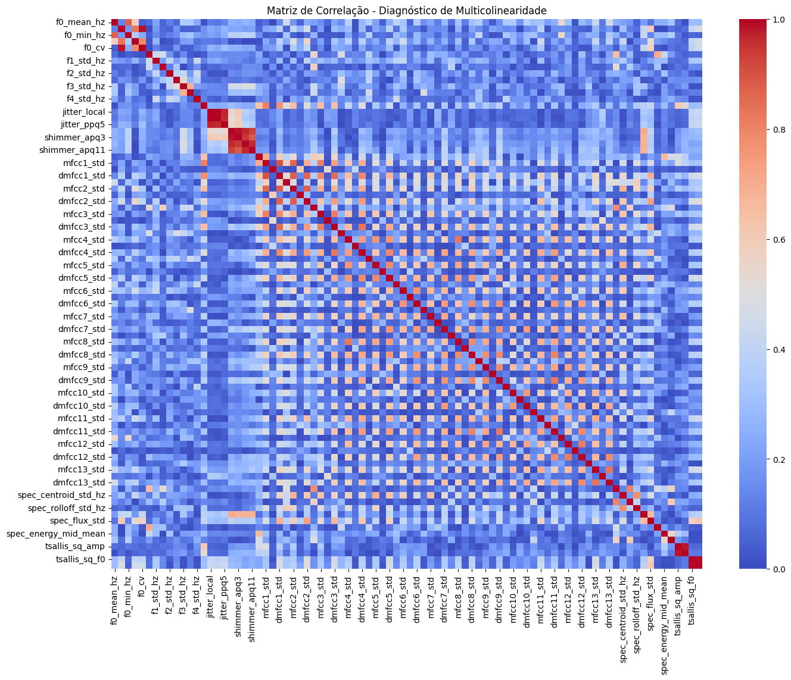

# Relatório de Engenharia de Dados e Pré-processamento

## Estudo de Biomarcadores Acústicos para o Diagnóstico da Doença de Parkinson

### 1. Introdução e Contextualização
A Doença de Parkinson (DP) é uma condição neurodegenerativa caracterizada por deficiências motoras e não motoras. A análise de sinais de voz tem se mostrado uma ferramenta não invasiva promissora para o rastreio precoce. Este documento detalha o protocolo de Extração, Transformação e Carga (ETL) e o Pipeline de Pré-processamento aplicado ao dataset de biomarcadores acústicos, visando garantir a integridade estatística para modelos de classificação subsequentes.

### 2. Configuração do Ambiente e Reprodutibilidade
Para garantir a validade científica e a capacidade de replicação do experimento, definem-se sementes globais (seeds) e o carregamento de bibliotecas especializadas em ciência de dados e aprendizado de máquina.

```python
# 1. Preprocessamento do Dataset

# ============================================
# 1) Bloco: Imports
# ============================================
import warnings
import os
import shutil
import pandas as pd
import numpy as np
import math

from sklearn.base import BaseEstimator, TransformerMixin
from sklearn.calibration import CalibratedClassifierCV
from sklearn.ensemble import AdaBoostClassifier, GradientBoostingClassifier, RandomForestClassifier
from sklearn.impute import SimpleImputer
from sklearn.linear_model import LogisticRegression
from sklearn.model_selection import GroupKFold, cross_validate
from sklearn.neighbors import KNeighborsClassifier
from sklearn.neural_network import MLPClassifier
from sklearn.preprocessing import RobustScaler
from sklearn.svm import SVC, LinearSVC
from sklearn.tree import DecisionTreeClassifier

from imblearn.over_sampling import SMOTE
from imblearn.pipeline import Pipeline as ImbPipeline

from xgboost import XGBClassifier
from catboost import CatBoostClassifier
from lightgbm import LGBMClassifier 

import seaborn as sns
import matplotlib.pyplot as plt

warnings.filterwarnings("ignore")

```
#### 2.1. Nota Técnica sobre o Ambiente

A escolha da biblioteca imblearn é estratégica para lidar com o desbalanceamento inerente a dados clínicos via SMOTE. Optou-se pelo RobustScaler em detrimento do StandardScaler devido à sua capacidade de lidar com outliers através da escala baseada em quartis (IQR), o que é essencial em sinais acústicos onde picos de ruído podem distorcer a média e o desvio padrão.

#### 2.2. Configurações Globais
Para garantir a reprodutibilidade e consistência, as principais configurações foram mantidas em um bloco de constantes.

```python
# ============================================
# 2) Bloco: Constantes
# ============================================

# --semente global para reprodutibilidade--
RNG_SEED = 42
np.random.seed(RNG_SEED)

# --diretórios de saída--
OUTPUT_DIR = 'output'
CATBOOST_DIR = 'catboost_info'

# --datasets-- para cada grupo (HC e PD) e para o dataset concatenado
DATASET_HC = 'data/dataset_voz_completo_HC.csv'
DATASET_PD = 'data/dataset_voz_completo_PD.csv'
DATASET_CONCAT = OUTPUT_DIR + '/dataset_concatenado.csv'
DATASET_IMPUTED = OUTPUT_DIR + '/dataset_imputed.csv'
DATASET_PROCESSED = OUTPUT_DIR + '/dataset_preprocessed.csv'

# --dataset reduzido (após seleção de features)-- para cada experimento (k8, k11, k16) e para cada método de seleção (mutual_info_classif e tsallis)
DATASET_K8 = OUTPUT_DIR + '/dataset_k8.csv'
DATASET_K11 = OUTPUT_DIR + '/dataset_k11.csv'
DATASET_K16 = OUTPUT_DIR + '/dataset_k16.csv'
DATASET_K8_TSALLIS = OUTPUT_DIR + '/dataset_k8_tsallis.csv'
DATASET_K11_TSALLIS = OUTPUT_DIR + '/dataset_k11_tsallis.csv'
DATASET_K16_TSALLIS = OUTPUT_DIR + '/dataset_k16_tsallis.csv'

# --resultados dos experimentos-- para cada experimento (k8, k11, k16) e para cada método de seleção (mutual_info_classif e tsallis)
RESULT_K8 = OUTPUT_DIR + '/resultados_k8.csv'
RESULT_K11 = OUTPUT_DIR + '/resultados_k11.csv'
RESULT_K16 = OUTPUT_DIR + '/resultados_k16.csv'
RESULT_K8_TSALLIS = OUTPUT_DIR + '/resultados_k8_tsallis.csv'
RESULT_K11_TSALLIS = OUTPUT_DIR + '/resultados_k11_tsallis.csv'
RESULT_K16_TSALLIS = OUTPUT_DIR + '/resultados_k16_tsallis.csv'

## --constantes para análise de correlação e ranking de importância--
CORRELATION_THRESHOLD = 0.9
CORRELATION_LIST = OUTPUT_DIR + '/lista_correlacao_completa.csv'
CORRELATION_GRAPH = OUTPUT_DIR + '/correlation_heatmap_completo.png'

CONSENSUS_RANKING = OUTPUT_DIR + '/ranking_importancia_completo.csv'

```
### 3. Aquisição e Estruturação de Dados
O conjunto de dados é composto por amostras acústicas classificadas em duas categorias: Healthy Control (HC) e Parkinson’s Disease (PD). O processo de carregamento inicial possibilita a análise da dimensionalidade do dataset, bem como a identificação das variáveis de interesse que servirão como alvo nas etapas subsequentes da investigação.
```python
# ============================================
# 4) Bloco: Carregar e Concatenar datasets
# ============================================
df_HC = pd.read_csv(DATASET_HC)
df_PD = pd.read_csv(DATASET_PD)
print("Shape original HC:", df_HC.shape)
print("Shape original DF:", df_PD.shape)

df_HC['status'] = 0
df_PD['status'] = 1

df_concat = pd.concat([df_HC, df_PD], ignore_index=True)
print("Shape final:", df_concat.shape)

# -------- SALVANDO O DATASET CONCATENADO --------
df_concat.to_csv(DATASET_CONCAT, index=False)

```

```
    Shape original HC: (41, 88)
    Shape original DF: (40, 88)
    Shape final: (81, 89)
```

### 4. Protocolo de Limpeza e Filtragem Estatística

Tendo em vista que o conjunto de dados dispõe de apenas 81 observações e 85 variáveis, configura-se um problema de alta dimensionalidade. Diante desse cenário, optou-se pela adoção de técnicas de imputação de valores ausentes em substituição ao descarte de registros, a fim de preservar a integridade e a representatividade da amostra

#### 4.1. Tratamento de Valores Ausentes e Outliers
Em oposição à utilização da média aritmética simples, optou-se pela adoção de técnicas de imputação fundamentadas na mediana, associadas a procedimentos de escalonamento robusto. Tal abordagem busca preservar a distribuição original das variáveis acústicas, reduzindo o impacto de valores extremos. A escolha pela mediana como parâmetro de imputação assegura a manutenção da tendência central sem ser influenciada por outliers do sinal, conferindo maior consistência e fidedignidade às análises subsequentes.
```python
# ============================================
# 5) Bloco: Identificar colunas com valores nulos
# ============================================
cols_with_nans = df_concat.columns[df_concat.isnull().any()].tolist()
print(cols_with_nans)

# Configurar e aplicar o Imputador pela Mediana
# A mediana é mais robusta a outliers comuns em sinais de áudio
imputer = SimpleImputer(strategy='median')

# Criamos uma cópia para preservar o dataframe original se necessário
df_imputed = df_concat.copy()

# Aplicamos a transformação apenas nas colunas identificadas
df_imputed[cols_with_nans] = imputer.fit_transform(df_imputed[cols_with_nans])

# Verificação
print(f"Imputação concluída nas colunas: {cols_with_nans}")
print("Total de valores nulos no dataset após o processo:", df_imputed.isnull().sum().sum())
```

``` 
    ['jitter_local', 'jitter_rap', 'jitter_ppq5', 'tsallis_sq_f0', 'shannon_s1_f0']
    Imputação concluída nas colunas: ['jitter_local', 'jitter_rap', 'jitter_ppq5', 'tsallis_sq_f0', 'shannon_s1_f0']
    Total de valores nulos no dataset após o processo: 0
``` 


### 5. Importância da Arquitetura por Sujeito: 

No contexto do diagnóstico vocal, um mesmo participante pode fornecer múltiplas amostras. Para mitigar o risco de dependência entre observações, o identificador subject_id é utilizado na etapa de validação cruzada por meio do método GroupKFold. Esse procedimento assegura que amostras provenientes de um mesmo indivíduo não sejam simultaneamente alocadas nos conjuntos de treinamento e teste, prevenindo o fenômeno de data leakage e evitando, assim, a obtenção de métricas de acurácia artificialmente infladas.

```python
# ============================================
# 6) Bloco: Extração do subject_id 
# ============================================
def extract_subject_id(name):
    parts = str(name).split('_')
    return parts[1] if len(parts) >= 2 else None

df = df_imputed.copy()  # Usamos o dataframe com valores imputados para a extração do subject_id
df["subject_id"] = df["file_name"].apply(extract_subject_id)

# checagem rápida
if df["subject_id"].isna().any():
    raise ValueError("Falha ao extrair subject_id de algumas linhas. Verifique o padrão da coluna 'name'.")

print("Nº de sujeitos:", df["subject_id"].nunique())


# -------- SALVANDO O DATASET IMPUTADO :: SUBJECT_ID --------
df.to_csv(DATASET_IMPUTED, index=False)
```
``` 
    Nº de sujeitos: 81

```

```python
# ============================================
# 7) Bloco: Preparar X, y e grupos
# Removemos metadados e o target das features
# ============================================

cols_to_drop = ["file_name", "group", "status", "subject_id"]

tsallis_cols = [c for c in df.columns if "tsallis" in c]
feature_cols = [c for c in df.columns if (c not in cols_to_drop) and (c not in tsallis_cols)]

X = df[feature_cols]
X_tsallis = df[feature_cols + tsallis_cols]
y = df["status"].astype(int)
groups = df["subject_id"]


print("\nBalanceamento (após limpeza):")
print(pd.Series(y).value_counts().rename(index={0: "Controle(0)", 1: "Parkinson(1)"}))

print(f"Colunas de Tsallis: {tsallis_cols}")
print(f"feature_cols: {feature_cols}")      
print(f"Total de features: {len(feature_cols)}")
    
```
``` 
    
    Balanceamento (após limpeza):
    status
    Controle(0)     41
    Parkinson(1)    40
    Name: count, dtype: int64
    Colunas de Tsallis: ['tsallis_sq_amp', 'tsallis_sq_f0']
    feature_cols: ['f0_mean_hz', 'f0_std_hz', 'f0_min_hz', 'f0_max_hz', 'f0_cv', 'f1_mean_hz', 'f1_std_hz', 'f2_mean_hz', 'f2_std_hz', 'f3_mean_hz', 'f3_std_hz', 'f4_mean_hz', 'f4_std_hz', 'hnr_mean_db', 'jitter_local', 'jitter_rap', 'jitter_ppq5', 'shimmer_local', 'shimmer_apq3', 'shimmer_apq5', 'shimmer_apq11', 'mfcc1_mean', 'mfcc1_std', 'dmfcc1_mean', 'dmfcc1_std', 'mfcc2_mean', 'mfcc2_std', 'dmfcc2_mean', 'dmfcc2_std', 'mfcc3_mean', 'mfcc3_std', 'dmfcc3_mean', 'dmfcc3_std', 'mfcc4_mean', 'mfcc4_std', 'dmfcc4_mean', 'dmfcc4_std', 'mfcc5_mean', 'mfcc5_std', 'dmfcc5_mean', 'dmfcc5_std', 'mfcc6_mean', 'mfcc6_std', 'dmfcc6_mean', 'dmfcc6_std', 'mfcc7_mean', 'mfcc7_std', 'dmfcc7_mean', 'dmfcc7_std', 'mfcc8_mean', 'mfcc8_std', 'dmfcc8_mean', 'dmfcc8_std', 'mfcc9_mean', 'mfcc9_std', 'dmfcc9_mean', 'dmfcc9_std', 'mfcc10_mean', 'mfcc10_std', 'dmfcc10_mean', 'dmfcc10_std', 'mfcc11_mean', 'mfcc11_std', 'dmfcc11_mean', 'dmfcc11_std', 'mfcc12_mean', 'mfcc12_std', 'dmfcc12_mean', 'dmfcc12_std', 'mfcc13_mean', 'mfcc13_std', 'dmfcc13_mean', 'dmfcc13_std', 'spec_centroid_mean_hz', 'spec_centroid_std_hz', 'spec_rolloff_mean_hz', 'spec_rolloff_std_hz', 'spec_flux_mean', 'spec_flux_std', 'spec_energy_low_mean', 'spec_energy_mid_mean', 'spec_energy_high_mean', 'shannon_s1_amp', 'shannon_s1_f0']
    Total de features: 84

``` 
#### 4.2. Tratamento de Outliers (Quantile Clipping)

O Quantile Clipping é uma técnica de tratamento de outliers que consiste em limitar os valores extremos de uma distribuição a percentis pré-definidos (ex: 1º e 99º percentis). Diferente da exclusão de amostras, esta técnica preserva o tamanho do dataset, o que é crítico em estudos clínicos onde o volume de dados é precioso, ao mesmo tempo que neutraliza o impacto de ruídos de leitura ou artefactos de sinal.

```python
# ============================================
# 8 ) Bloco: QuantileClipper
# ============================================
class QuantileClipper(BaseEstimator, TransformerMixin):
    def __init__(self, low=0.01, high=0.99):
        self.low = low
        self.high = high

    def fit(self, X, y=None):
        X = np.asarray(X, dtype=float)
        # Calcula os limites (quantis) para cada coluna
        self.lo_ = np.nanquantile(X, self.low, axis=0)
        self.hi_ = np.nanquantile(X, self.high, axis=0)
        return self

    def transform(self, X):
        X = np.asarray(X, dtype=float)
        # Aplica o limitador: valores abaixo de lo_ viram lo_ 
        # e acima de hi_ viram hi_
        return np.clip(X, self.lo_, self.hi_)
```
### 5. Análise de Importância Clínica (Top 16 Features)


Para a etapa de seleção de atributos, foi implementado um algoritmo de Consenso de Ranking, no qual se combinaram os resultados provenientes de três modelos distintos: Random Forest, XGBoost e CatBoost. 

#### 6.1. Aplicação de Lógica de Consenso
AA lógica de consenso tem como objetivo mitigar o viés associado a cada algoritmo individual, conferindo maior robustez ao processo de seleção ao privilegiar variáveis cuja relevância se manifesta de forma consistente entre diferentes modelos.

O ranking final evidenciou a predominância de determinadas famílias de biomarcadores, destacando grupos de atributos acústicos que se mostraram recorrentes e informativos para a tarefa de classificação:

    - 1. D-MFCCs e MFCCs: Representam a forma do trato vocal e a qualidade da articulação, frequentemente afetadas pela disartria parkinsoniana.

    - 2. Shimmer e Jitter: (Ex: shimmer_local) Indicam instabilidade na amplitude e frequência da vibração das pregas vocais, refletindo tremores laríngeos precoces.

    - 3. F0_CV: O coeficiente de variação da frequência fundamental (f0) é um indicador chave da monotonia vocal, um sintoma clássico da DP.

```python
# ============================================
# 9) Bloco: Função de consenso de features
# ============================================
def get_consensus_features(rf_imp, xgb_imp, cat_imp, top_k=16):
    """Combine rankings of the 3 models to obtain consensus on the best features"""

   # Garante que os DataFrames de importância estejam ordenados para gerar o rank correto
    rf_ranked = rf_imp.sort_values(by='importance', ascending=False).reset_index(drop=True)
    xgb_ranked = xgb_imp.sort_values(by='importance', ascending=False).reset_index(drop=True)
    cat_ranked = cat_imp.sort_values(by='importance', ascending=False).reset_index(drop=True)

    # Cria dicionários {nome_da_feature: posicao_no_rank}
    rf_rank_dict = {row['feature']: idx + 1 for idx, row in rf_ranked.iterrows()}
    xgb_rank_dict = {row['feature']: idx + 1 for idx, row in xgb_ranked.iterrows()}
    cat_rank_dict = {row['feature']: idx + 1 for idx, row in cat_ranked.iterrows()}
    
    all_features = set(rf_rank_dict.keys()) | set(xgb_rank_dict.keys()) | set(cat_rank_dict.keys())

    consensus_data = []
    for feature in all_features:
        # Busca a posição em cada modelo (se não existir, penaliza com o pior rank + 1)
        r_pos = rf_rank_dict.get(feature, len(rf_ranked) + 1)
        x_pos = xgb_rank_dict.get(feature, len(xgb_ranked) + 1)
        c_pos = cat_rank_dict.get(feature, len(cat_ranked) + 1)
        
        avg_rank = (r_pos + x_pos + c_pos) / 3
        consensus_data.append({
            'feature': feature,
            'rf_rank': r_pos,
            'xgb_rank': x_pos,
            'cat_rank': c_pos,
            'average_rank': avg_rank
        })
    
    # Ordena pelo rank médio (quanto menor, mais importante)
    df_consensus = pd.DataFrame(consensus_data).sort_values(by='average_rank').reset_index(drop=True)
    df_consensus.insert(0, 'final_rank', df_consensus.index + 1) # Insere a coluna de posição final

    return df_consensus
```


```python
# ============================================
# 10) Pré-processamento comum
# ============================================
preprocess = ImbPipeline(steps=[
    ("clip", QuantileClipper(0.01, 0.99)),
    ("scale", RobustScaler())
])

X_proc = preprocess.fit_transform(X)
X_tsallis_proc = preprocess.fit_transform(X_tsallis)

```


```python
# ============================================
# 11) Bloco: Consolidação do Dataset Pré-processado
# ============================================

# 1. Converter matrizes processadas de volta para DataFrame
# Importante: Garantir que o index seja o mesmo do 'df' original para evitar desalinhamento
df_feat_proc = pd.DataFrame(
    X_proc, 
    columns=feature_cols, 
    index=df.index
)

df_tsallis_proc = pd.DataFrame(
    X_tsallis_proc, 
    columns=feature_cols + tsallis_cols, 
    index=df.index
)

# 2. Criar o DataFrame unificado (Features + Tsallis + Metadados)
# Usamos df_tsallis_proc pois ele é o "superset" (contém todas as colunas de X_proc)
df_pre_processed = df_tsallis_proc.copy()

# Adicionar metadados do df original
df_pre_processed["status"] = df["status"].values
df_pre_processed["subject_id"] = df["subject_id"].values

# 3. Salvar o arquivo mestre pré-processado
# Este arquivo servirá de base para as seleções K8, K11 e K16
df_pre_processed.to_csv(DATASET_PROCESSED, index=False)

print(f"Sucesso! Dataset consolidado criado.")
print(f"Shape final: {df_pre_processed.shape}")
print(f"Arquivo salvo em: {DATASET_PROCESSED}")
```
```
    Sucesso! Dataset consolidado criado.
    Shape final: (81, 88)
    Arquivo salvo em: output/dataset_preprocessed.csv
```


```python
# ============================================
# 12) Bloco: Treinamento dos Modelos e Extração de Importância
# ============================================
# Random Forest
rf = RandomForestClassifier(
    n_estimators=100,
    max_depth=3,
    random_state=RNG_SEED,
    class_weight="balanced",
    n_jobs=1
)
rf.fit(X_proc, y)
rf_importance = pd.DataFrame({
    "feature": feature_cols,
    "importance": rf.feature_importances_
}).sort_values("importance", ascending=False)


# XGBoost
xgb = XGBClassifier(
    n_estimators=100,
    max_depth=2,
    learning_rate=0.05,
    subsample=0.7,
    colsample_bytree=0.7,
    eval_metric="logloss",
    random_state=RNG_SEED,
    n_jobs=1
)
xgb.fit(X_proc, y)
xgb_importance = pd.DataFrame({
    "feature": feature_cols,
    "importance": xgb.feature_importances_
}).sort_values("importance", ascending=False)


# CatBoost
cat = CatBoostClassifier(
    iterations=100,
    depth=2,
    learning_rate=0.05,
    loss_function="Logloss",
    verbose=False,
    random_seed=RNG_SEED,
    thread_count=1,
    allow_writing_files=False
)
cat.fit(X_proc, y)
cat_importance = pd.DataFrame({
    "feature": feature_cols,
    "importance": cat.get_feature_importance()
}).sort_values("importance", ascending=False)
```


```python
# ============================================
# 13) Bloco: Consolidação do Ranking de Importância (CSV)
# ============================================

# Obter o DataFrame completo de consenso
df_ranking_completo = get_consensus_features(
    rf_imp=rf_importance,
    xgb_imp=xgb_importance,
    cat_imp=cat_importance,
    top_k=len(feature_cols) # Pega todas as features para o CSV
)

# Salvar o ranking detalhado em CSV
df_ranking_completo.to_csv(CONSENSUS_RANKING, index=False)
print(f"\nArquivo {CONSENSUS_RANKING} salvo com sucesso.")
```
```
    
    Arquivo output/ranking_importancia_completo.csv salvo com sucesso.
```


```python
# ============================================
# 14) Bloco: Gerar as listas de features para K8, K11 e K16
# ============================================

# 1. Definindo os tamanhos desejados
K_8, K_11, K_16 = 8, 11, 16

# 2. Criando as 3 listas específicas
top_features_list_8  = df_ranking_completo['feature'].head(K_8).tolist()
top_features_list_11 = df_ranking_completo['feature'].head(K_11).tolist()
top_features_list_16 = df_ranking_completo['feature'].head(K_16).tolist()

# 3. Mostrar os rankings no console (exibindo até a maior, 16)
print(f"Top {K_16} features por consenso:")
print(df_ranking_completo[['final_rank', 'feature', 'average_rank']].head(K_16))


# 4. Validação de segurança
# Validamos apenas a lista de 16, pois se ela existir no DF, as menores obrigatoriamente também existem.
missing = set(top_features_list_16) - set(df.columns)
if missing:
    raise ValueError(f"Colunas selecionadas (Top 16) não encontradas no dataset: {missing}")

```

    Top 16 features por consenso:

| **final_rank** | **feature** | **average_rank** |
| --- | --- | --- |
| 1 | dmfcc6_std | 2.666667 |
| 2 | dmfcc11_std | 5.666667 |
| 3 | mfcc13_std | 5.666667 |
| 4 | mfcc10_std | 6.666667 |
| 5 | mfcc11_std | 7.666667 |
| 6 | mfcc9_std | 10.333333 |
| 7 | dmfcc3_mean | 10.666667 |
| 8 | mfcc2_mean | 13.000000 |
| 9 | spec_centroid_mean_hz | 16.000000 |
| 10 | mfcc3_std | 16.666667 |
| 11 | mfcc1_mean | 16.666667 |
| 12 | spec_energy_mid_mean | 19.666667 |
| 13 | shimmer_local | 21.000000 |
| 14 | shimmer_apq3 | 22.000000 |
| 15 | dmfcc4_std | 22.000000 |
| 16 | f0_cv | 23.000000 |

#### 6.2. Estudo de Ablação e Variáveis de Complexidade

Antes da etapa de modelagem final, o pipeline realiza a preparação dos conjuntos de dados para a condução de um Estudo de Ablação. O propósito dessa análise é avaliar se a inclusão da Entropia de Tsallis, enquanto métrica de complexidade não linear, proporciona ganho informacional em relação aos coeficientes cepstrais de frequência mel (MFCCs), tradicionalmente empregados na caracterização acústica.


```python
# ============================================
# 15) Criar datasets k8, k11, k16 (features + status + subject_id)
# ============================================

# Lista de colunas fixas que sempre devem estar presentes
fixed_cols = ["status", "subject_id"]

# Criando os DataFrames de forma segura (selecionando direto do df processado)
# Nota: 'df_pre_processed' aqui deve ser o seu DataFrame final após Scaler e Imputer
df_k8  = df_pre_processed[top_features_list_8 + fixed_cols].copy()
df_k11 = df_pre_processed[top_features_list_11 + fixed_cols].copy()
df_k16 = df_pre_processed[top_features_list_16 + fixed_cols].copy()

# Criando as versões para Ablação (Top K + Tsallis)
# Como todas já estão no 'df_pre_processed', basta somar as listas de colunas
df_k8_tsallis  = df_pre_processed[top_features_list_8 + tsallis_cols + fixed_cols].copy()
df_k11_tsallis = df_pre_processed[top_features_list_11 + tsallis_cols + fixed_cols].copy()
df_k16_tsallis = df_pre_processed[top_features_list_16 + tsallis_cols + fixed_cols].copy()

print(f"Shapes confirmados:")
print(f"K8: {df_k8.shape} | K8+Tsallis: {df_k8_tsallis.shape}")
print(f"K11: {df_k11.shape} | K11+Tsallis: {df_k11_tsallis.shape}")
print(f"K16: {df_k16.shape} | K16+Tsallis: {df_k16_tsallis.shape}")
```
```
    Shapes confirmados:
    K8: (81, 10) | K8+Tsallis: (81, 12)
    K11: (81, 13) | K11+Tsallis: (81, 15)
    K16: (81, 18) | K16+Tsallis: (81, 20)
```


```python
# ============================================
# 16) Salvar datasets
# ============================================

# Dicionário para automação do salvamento
datasets_to_save = {
    DATASET_K8: df_k8,
    DATASET_K11: df_k11,
    DATASET_K16: df_k16,
    DATASET_K8_TSALLIS: df_k8_tsallis,
    DATASET_K11_TSALLIS: df_k11_tsallis,
    DATASET_K16_TSALLIS: df_k16_tsallis
}

print("\nSalvando arquivos...")
for path, dataframe in datasets_to_save.items():
    dataframe.to_csv(path, index=False)
    print(f"  [OK] {path}")
```


## 7. Geração dos Resultados e Benchmarking

### 7.1 Preparação dos dados

Na etapa inicial de preparação dos dados, procede-se à definição das matrizes de preditores (X), da variável alvo (y) e dos grupos de validação. Para garantir a integridade do processo de modelagem, são removidos os metadados e o atributo de classificação (status), de modo que apenas as variáveis acústicas permaneçam como features. Essa organização permite estruturar diferentes conjuntos de atributos (k8, k11, k16 e suas respectivas versões com Entropia de Tsallis), assegurando consistência na comparação entre modelos. Além disso, a variável subject_id é utilizada para compor os grupos, prevenindo o risco de dependência entre amostras de um mesmo participante durante a validação cruzada. Por fim, realiza-se a verificação do balanceamento das classes, etapa fundamental para avaliar a representatividade entre os grupos de controle e pacientes com Parkinson.


```python
# ============================================
# 1) Preparar X, y e grupos
# Removemos metadados e o target das features
# ============================================

cols_to_drop = ["status", "subject_id"]
feature_cols_k8 = [c for c in df_k8.columns if c not in cols_to_drop]
feature_cols_k11 = [c for c in df_k11.columns if c not in cols_to_drop]
feature_cols_k16 = [c for c in df_k16.columns if c not in cols_to_drop]
feature_cols_k8_tsallis = [c for c in df_k8_tsallis.columns if c not in cols_to_drop]
feature_cols_k11_tsallis = [c for c in df_k11_tsallis.columns if c not in cols_to_drop]
feature_cols_k16_tsallis = [c for c in df_k16_tsallis.columns if c not in cols_to_drop]


X_k8 = df_k8[feature_cols_k8]
X_k11 = df_k11[feature_cols_k11]
X_k16 = df_k16[feature_cols_k16]
X_k8_tsallis = df_k8_tsallis[feature_cols_k8_tsallis]
X_k11_tsallis = df_k11_tsallis[feature_cols_k11_tsallis]
X_k16_tsallis = df_k16_tsallis[feature_cols_k16_tsallis]

y = df_k16["status"].astype(int)
groups = df_k16["subject_id"]

print("Colunas a serem descartadas:", cols_to_drop)
print("Colunas de features k8:", feature_cols_k8)
print(len(feature_cols_k8), "features selecionadas.")
print("Colunas de features k11:", feature_cols_k11)
print(len(feature_cols_k11), "features selecionadas.")
print("Colunas de features k16:", feature_cols_k16)
print(len(feature_cols_k16), "features selecionadas.")
print("Colunas de features k8_tsallis:", feature_cols_k8_tsallis)
print(len(feature_cols_k8_tsallis), "features selecionadas.")
print("Colunas de features k11_tsallis:", feature_cols_k11_tsallis)
print(len(feature_cols_k11_tsallis), "features selecionadas.")
print("Colunas de features k16_tsallis:", feature_cols_k16_tsallis)
print(len(feature_cols_k16_tsallis), "features selecionadas.")

print("\nBalanceamento:")
print(pd.Series(y).value_counts().rename(index={0: "Controle(0)", 1: "Parkinson(1)"}))
```


```python
# ============================================
# 2) Função do pipeline de execução do Benchmark entre modelos
# ============================================

def make_pipeline(model):
    return ImbPipeline(steps=[  
        # 1. RobustScaler: Escalonamento robusto baseado em quartis
        ("scale", RobustScaler()),

        # 2. SMOTE: Balanceamento sintético aplicado apenas durante o 'fit' (treino)
        ("smote", SMOTE(random_state=RNG_SEED, k_neighbors=3)),

        # 3. O Classificador (SVC, XGBoost, etc.)
        ("clf", model)
    ])
```
### 7.2. Interpretação de Métricas Clínicas

Em cenários de diagnóstico clínico, a acurácia simples não constitui um indicador suficientemente robusto para avaliar o desempenho dos modelos. Nesse contexto, a métrica de Balanced Accuracy assume papel central, uma vez que pondera de forma equitativa o desempenho em ambas as classes e, neste estudo, é complementada pela análise do desvio padrão obtido entre os folds da validação cruzada. Essa escolha metodológica se justifica pelo elevado custo associado a falsos negativos, isto é, casos em que a doença não é identificada. Outro aspecto relevante é a métrica ROC AUC, que mensura a capacidade discriminativa do modelo, refletindo sua aptidão em distinguir corretamente entre as classes avaliadas.

```python
# =========================================================
# 3) Função do Benchmark: roda GroupKFold Cross_Validate e devolve tabela resumo
# =========================================================

def benchmark_models(X, y, groups, models_dict, n_splits=5, n_jobs=1):
    cv = GroupKFold(n_splits=n_splits)

    scoring = {
        "bal_acc": "balanced_accuracy",
        "roc_auc": "roc_auc",
        "f1": "f1",
    }

    rows = []
    for name, model in models_dict.items():
        pipe = make_pipeline(model)

        scores = cross_validate(
            pipe, X, y,
            groups=groups,
            cv=cv,
            scoring=scoring,
            n_jobs=n_jobs,
            error_score="raise"
        )

        rows.append({
            "model": name,
            "bal_acc_mean": float(np.mean(scores["test_bal_acc"])),
            "bal_acc_std":  float(np.std(scores["test_bal_acc"])),
            "roc_auc_mean": float(np.mean(scores["test_roc_auc"])),
            "roc_auc_std":  float(np.std(scores["test_roc_auc"])),
            "f1_mean":      float(np.mean(scores["test_f1"])),
            "f1_std":       float(np.std(scores["test_f1"])),
        })

    return pd.DataFrame(rows).sort_values("bal_acc_mean", ascending=False).reset_index(drop=True)

```


### 7.3 Modelos Clássicos
Nesta etapa, foram implementados e configurados diferentes algoritmos de classificação supervisionada, contemplando tanto abordagens lineares quanto não lineares. Entre os modelos avaliados, destacam-se a regressão logística com regularização L2, máquinas de vetor de suporte com kernel radial (SVC-RBF), classificadores derivados de LinearSVC, além de métodos baseados em árvores de decisão, como Random Forest, Gradient Boosting, AdaBoost e Decision Tree.

Adicionalmente, foram incorporados algoritmos de vizinhança (KNN), redes neurais artificiais (MLP), bem como técnicas de ensemble boosting de última geração, incluindo XGBoost, CatBoost e LightGBM. O ajuste dos hiperparâmetros foi conduzido levando em consideração o problema de alta dimensionalidade e a escassez de registros disponíveis no conjunto de dados, de modo a favorecer a generalização e reduzir o risco de sobreajuste. Essa diversidade metodológica possibilitou uma comparação abrangente entre diferentes paradigmas de aprendizado de máquina, fornecendo uma base sólida para a seleção do modelo mais adequado, de acordo com os dados do estudo, ao diagnóstico vocal.

```python
# =========================================================
# 4) Modelos Classicos - Ajuste fino
# =========================================================

models = {
    "logreg_l2": LogisticRegression(
            C=0.5,
            solver="liblinear",
            max_iter=5000,
            class_weight="balanced",
            random_state=RNG_SEED,
        ),

    "svc_rbf":  SVC(
            C=1.0,
            gamma="scale",
            kernel="rbf",
            probability=True,
            class_weight="balanced",
            random_state=RNG_SEED,
        ),
    
    "linear_svc_cal": CalibratedClassifierCV(
            estimator=LinearSVC(
                C=0.1,
                class_weight="balanced",
                random_state=RNG_SEED,
                max_iter=10000,
                dual=False
            ),
            method="sigmoid",
            cv=3,
        ),
    
    "random_forest": RandomForestClassifier(
            n_estimators=200,
            max_depth=3,
            min_samples_split=10,
            min_samples_leaf=5,
            class_weight="balanced",
            random_state=RNG_SEED,
            n_jobs=-1,
        ),
    
    "gradient_boosting": GradientBoostingClassifier(
            n_estimators=100,
            learning_rate=0.02,
            max_depth=2,
            subsample=0.6,
            random_state=RNG_SEED,
        ),
    
    "adaboost": AdaBoostClassifier(
            estimator=DecisionTreeClassifier(
                max_depth=1, 
                random_state=RNG_SEED
                ),
            n_estimators=100,
            learning_rate=0.5,            
            random_state=RNG_SEED,
        ),
    
    "decision_tree": DecisionTreeClassifier(
            max_depth=2,
            min_samples_leaf=5,
            class_weight="balanced",
            random_state=RNG_SEED,
        ),
    
    "knn": KNeighborsClassifier(
            n_neighbors=7,
            weights="uniform",
            metric="minkowski",
            p=2,
        ),
    
    "mlp": MLPClassifier(
            hidden_layer_sizes=(4,),
            solver='lbfgs',
            alpha=1.0,
            max_iter=500,
            random_state=RNG_SEED,
            early_stopping=True,
            validation_fraction=0.1
        ),
    
    "xgboost": XGBClassifier(
            n_estimators=150,
            max_depth=2,
            learning_rate=0.02,
            subsample=0.6,          
            colsample_bytree=0.6,   
            gamma=2,                
            reg_alpha=1.0,          
            reg_lambda=2.0,         
            min_child_weight=5,
            objective="binary:logistic",
            random_state=RNG_SEED,
            n_jobs=-1,
            verbosity=0,
        ),
    
    "catboost": CatBoostClassifier(
        iterations=200, 
        depth=2, 
        learning_rate=0.02,
        l2_leaf_reg=10,          
        bootstrap_type='Bernoulli',
        subsample=0.5,
        loss_function='Logloss', 
        verbose=0, 
        random_seed=RNG_SEED,
        allow_writing_files=False 
    ),

    "lightgbm": LGBMClassifier(
        n_estimators=100, 
        learning_rate=0.02, 
        num_leaves=3,
        min_child_samples=5,
        boosting_type='goss',
        random_state=RNG_SEED, 
        n_jobs=-1, 
        colsample_bytree=0.5,
        importance_type='gain',
        verbosity=-1,
    )
}

```


```python
# =========================================================
# 5) Rodar benchmark (GroupKFold por sujeito)
# =========================================================
results_k8 = benchmark_models(X_k8, y, groups, models, n_splits=5, n_jobs=1)
results_k11 = benchmark_models(X_k11, y, groups, models, n_splits=5, n_jobs=1)
results_k16 = benchmark_models(X_k16, y, groups, models, n_splits=5, n_jobs=1)
results_k8_tsallis = benchmark_models(X_k8_tsallis, y, groups, models, n_splits=5, n_jobs=1)
results_k11_tsallis = benchmark_models(X_k11_tsallis, y, groups, models, n_splits=5, n_jobs=1)
results_k16_tsallis = benchmark_models(X_k16_tsallis, y, groups, models, n_splits=5, n_jobs=1)  

# Mostrar ranking
print("\n=== Ranking por Balanced Accuracy (GroupKFold, sem leakage) ===")
print("\n=== Ranking k8 ===")
print(results_k8)
print("\n=== Ranking k11 ===")
print(results_k11)
print("\n=== Ranking k16 ===")
print(results_k16)
print("\n=== Ranking k8 + Tsallis ===")
print(results_k8_tsallis)
print("\n=== Ranking k11 + Tsallis ===")
print(results_k11_tsallis)
print("\n=== Ranking k16 + Tsallis ===")
print(results_k16_tsallis)
```

### 7.4. Rankings por Balanced Accuracy (GroupKFold, sem leakage)

- ##### Ranking k8 (8 features) 
    |              model | bal_acc_mean | bal_acc_std | roc_auc_mean | roc_auc_std |      f1_mean |   f1_std  |
    |---|---|---|---|---|---|---|
    |            xgboost |     0.765278 |    0.058002 |     0.807465 |     0.027529|     0.745219 |  0.066409 |
    |      random_forest |     0.727778 |    0.100673 |     0.813889 |     0.040840|     0.729762 |  0.086025 | 
    |           catboost |     0.727778 |    0.146355 |     0.822569 |     0.065499|     0.741429 |  0.113897 |
    |           lightgbm |     0.727778 |    0.083726 |     0.798264 |     0.037660|     0.724524 |  0.077517 | 
    |          logreg_l2 |     0.726389 |    0.064340 |     0.837847 |     0.066849|     0.716941 |  0.051426 |
    |     linear_svc_cal |     0.726389 |    0.064340 |     0.828819 |     0.072107|     0.716941 |  0.051426 | 
    |  gradient_boosting |     0.715278 |    0.101017 |     0.801562 |     0.066951|     0.714411 |  0.081313 | 
    |            svc_rbf |     0.713889 |    0.075742 |     0.782292 |     0.048457|     0.710015 |  0.047050 | 
    |                mlp |     0.713889 |    0.075742 |     0.759375 |     0.050000|     0.704560 |  0.046308 | 
    |           adaboost |     0.693056 |    0.098347 |     0.785243 |     0.085288|     0.689677 |  0.073550 | 
    |      decision_tree |     0.690278 |    0.059187 |     0.710764 |     0.064698|     0.672619 |  0.070026 |
    |                knn |     0.677778 |    0.102213 |     0.784375 |     0.058170|     0.701190 |  0.048853 | 
    
    
       
- ##### Ranking k11 (11 features)
    |                    model | bal_acc_mean |  bal_acc_std | roc_auc_mean |  roc_auc_std |  f1_mean |    f1_std | 
    |---|---|---|---|---|---|---|
    |            xgboost |     0.776389 |    0.049379  |    0.828646  |   0.038920 |  0.754743 | 0.057243 |  
    |      random_forest |     0.752778 |    0.103059  |    0.814236  |   0.049969 |  0.752130 | 0.099824 |
    |            svc_rbf |     0.751389 |    0.104619  |    0.812847  |   0.066540 |  0.743211 | 0.098439 | 
    |           catboost |     0.738889 |    0.100212  |    0.825694  |   0.071046 |  0.739286 | 0.081001 |
    |                knn |     0.713889 |    0.114901  |    0.832118  |   0.092900 |  0.693333 | 0.138884 | 
    |          logreg_l2 |     0.713889 |    0.085436  |    0.809375  |   0.087500 |  0.709588 | 0.064908 |
    |                mlp |     0.701389 |    0.121795  |    0.780208  |   0.089329 |  0.700000 | 0.118187 |  
    |  gradient_boosting |     0.701389 |    0.145204  |    0.785069  |   0.082836 |  0.711905 | 0.094161 | 
    |           lightgbm |     0.701389 |    0.139720  |    0.782986  |   0.047061 |  0.711776 | 0.068922 |
    |      decision_tree |     0.680556 |    0.041898  |    0.686285  |   0.051301 |  0.664744 | 0.047522 |
    |     linear_svc_cal |     0.676389 |    0.062977  |    0.800694  |   0.082705 |  0.659039 | 0.067020 |
    |           adaboost |     0.629167 |    0.088780  |    0.736458  |   0.096914 |  0.641667 | 0.081650 |
    
             
- ##### Ranking k16 (16 features)
    |                model | bal_acc_mean | bal_acc_std | roc_auc_mean | roc_auc_std |  f1_mean |   f1_std | 
    |---|---|---|---|---|---|---| 
    |            svc_rbf   |   0.790278   |  0.108155   |   0.825000   |  0.108433   | 0.777521 | 0.110582 | 
    |            xgboost   |   0.752778   |  0.052997   |   0.806597   |  0.035948   | 0.734230 | 0.066072 |  
    |           catboost   |   0.751389   |  0.111838   |   0.844444   |  0.074621   | 0.754286 | 0.096347 |  
    |      random_forest   |   0.738889   |  0.100212   |   0.827083   |  0.066813   | 0.742857 | 0.086337 |  
    |  gradient_boosting   |   0.726389   |  0.093953   |   0.835069   |  0.073788   | 0.729524 | 0.060113 |  
    |                mlp   |   0.715278   |  0.123447   |   0.829167   |  0.064835   | 0.727778 | 0.111665 | 
    |     linear_svc_cal   |   0.702778   |  0.082683   |   0.783333   |  0.097417   | 0.675812 | 0.088478 | 
    |          logreg_l2   |   0.702778   |  0.074974   |   0.797917   |  0.110799   | 0.684057 | 0.079989 |  
    |           adaboost   |   0.702778   |  0.099807   |   0.831944   |  0.088166   | 0.714525 | 0.094408 |  
    |                knn   |   0.701389   |  0.062423   |   0.814757   |  0.073316   | 0.671429 | 0.082685 | 
    |           lightgbm   |   0.676389   |  0.074354   |   0.776042   |  0.069018   | 0.684524 | 0.043252 |  
    |      decision_tree   |   0.630556   |  0.105171   |   0.670660   |  0.070614   | 0.646930 | 0.072707 |  
    
 
    

 - ##### Ranking k8 + Tsallis (8 features + 2 features tsallis)
    
      |              model | bal_acc_mean | bal_acc_std | roc_auc_mean | roc_auc_std |  f1_mean  |  f1_std  |
      |---|---|---|---|---|---|---| 
      |      random_forest |     0.752778 |    0.111941 |     0.810069 |    0.052206 |  0.761429 | 0.094421 |
      |           catboost |     0.752778 |    0.111941 |     0.788542 |    0.058889 |  0.761429 | 0.094421 |
      |            xgboost |     0.740278 |    0.071173 |     0.819618 |    0.035885 |  0.727735 | 0.068894 |
      |            svc_rbf |     0.738889 |    0.074354 |     0.766667 |    0.047781 |  0.717479 | 0.080124 |
      |  gradient_boosting |     0.729167 |    0.107851 |     0.784375 |    0.069457 |  0.732254 | 0.084047 |
      |      decision_tree |     0.729167 |    0.069722 |     0.736632 |    0.066404 |  0.726754 | 0.075301 |
      |          logreg_l2 |     0.726389 |    0.085233 |     0.796875 |    0.083268 |  0.717207 | 0.072404 |
      |           adaboost |     0.716667 |    0.070465 |     0.792708 |    0.050754 |  0.717857 | 0.057853 |
      |     linear_svc_cal |     0.713889 |    0.084414 |     0.794444 |    0.081568 |  0.697427 | 0.083205 | 
      |                mlp |     0.713889 |    0.124335 |     0.755208 |    0.041667 |  0.714683 | 0.105412 | 
      |           lightgbm |     0.702778 |    0.082683 |     0.776042 |    0.035325 |  0.693333 | 0.053333 |
      |                knn |     0.690278 |    0.079252 |     0.758333 |    0.078080 |  0.684766 | 0.051086 | 
    
 

 - ##### Ranking k11 + Tsallis (11 features + 2 features tsallis)
      |              model | bal_acc_mean | bal_acc_std | roc_auc_mean | roc_auc_std |  f1_mean  |  f1_std  |
      |---|---|---|---|---|---|---| 
      |           catboost |     0.763889 |    0.072701 |     0.815972 |    0.052025 |  0.754987 | 0.066706 |
      |      random_forest |     0.752778 |    0.103059 |     0.808333 |    0.046046 |  0.753095 | 0.093215 |
      |            xgboost |     0.741667 |    0.066667 |     0.808507 |    0.029532 |  0.725896 | 0.075956 |
      |  gradient_boosting |     0.738889 |    0.107726 |     0.782986 |    0.073739 |  0.733935 | 0.083585 |
      |            svc_rbf |     0.726389 |    0.085233 |     0.785069 |    0.067216 |  0.712763 | 0.067716 |
      |      decision_tree |     0.716667 |    0.070465 |     0.708507 |    0.082593 |  0.699831 | 0.085545 |
      |          logreg_l2 |     0.713889 |    0.085436 |     0.778125 |    0.094476 |  0.709588 | 0.064908 |
      |           lightgbm |     0.702778 |    0.072622 |     0.766667 |    0.057941 |  0.691667 | 0.059161 |
      |                mlp |     0.701389 |    0.083795 |     0.727083 |    0.139467 |  0.708733 | 0.053367 |
      |     linear_svc_cal |     0.688889 |    0.081271 |     0.763542 |    0.098744 |  0.676182 | 0.086956 |
      |                knn |     0.677778 |    0.068690 |     0.728993 |    0.068341 |  0.626832 | 0.087347 |
      |           adaboost |     0.652778 |    0.102721 |     0.785417 |    0.106607 |  0.672464 | 0.092020 |
    

    
 - ##### Ranking k16 + Tsallis (16 features + 2 features tsallis)
      |              model | bal_acc_mean | bal_acc_std | roc_auc_mean | roc_auc_std |  f1_mean  |  f1_std  |
      |---|---|---|---|---|---|---| 
      |            svc_rbf |     0.790278 |    0.108155 |     0.819097 |    0.103175 |  0.777521 | 0.110582 | 
      |      random_forest |     0.763889 |    0.127370 |     0.833333 |    0.077462 |  0.769524 | 0.115526 | 
      |            xgboost |     0.752778 |    0.077030 |     0.816840 |    0.045099 |  0.736885 | 0.077441 | 
      |           adaboost |     0.727778 |    0.096265 |     0.815972 |    0.105381 |  0.743529 | 0.087534 | 
      |           catboost |     0.727778 |    0.100673 |     0.823611 |    0.070458 |  0.729762 | 0.086025 | 
      |  gradient_boosting |     0.716667 |    0.080795 |     0.807292 |    0.085645 |  0.718333 | 0.070789 | 
      |                knn |     0.701389 |    0.073886 |     0.763542 |    0.080391 |  0.675476 | 0.078056 | 
      |           lightgbm |     0.690278 |    0.090502 |     0.770833 |    0.052395 |  0.701667 | 0.063770 | 
      |          logreg_l2 |     0.677778 |    0.109590 |     0.794792 |    0.094361 |  0.681624 | 0.096780 | 
      |      decision_tree |     0.666667 |    0.133723 |     0.692882 |    0.099351 |  0.682018 | 0.107684 | 
      |     linear_svc_cal |     0.665278 |    0.111319 |     0.770486 |    0.098089 |  0.646752 | 0.124228 | 
      |                mlp |     0.665278 |    0.096265 |     0.739583 |    0.115009 |  0.677778 | 0.093550 | 
    
         

```python
# =========================================================
# 6) Salvando os resultados em CSV
# =========================================================
results_k8.to_csv(RESULT_K8, index=False)
print(f'Resultados salvos no arquivo {RESULT_K8}')

results_k8.to_csv(RESULT_K11, index=False)
print(f'Resultados salvos no arquivo {RESULT_K11}')

results_k8.to_csv(RESULT_K16, index=False)
print(f'Resultados salvos no arquivo {RESULT_K16}')

results_k8_tsallis.to_csv(RESULT_K8_TSALLIS, index=False)
print(f'Resultados salvos no arquivo {RESULT_K8_TSALLIS}')

results_k11_tsallis.to_csv(RESULT_K11_TSALLIS, index=False)
print(f'Resultados salvos no arquivo {RESULT_K11_TSALLIS}')

results_k16_tsallis.to_csv(RESULT_K16_TSALLIS, index=False)
print(f'Resultados salvos no arquivo {RESULT_K16_TSALLIS}')
```

    Resultados salvos no arquivo output/resultados_k8.csv
    Resultados salvos no arquivo output/resultados_k11.csv
    Resultados salvos no arquivo output/resultados_k16.csv
    Resultados salvos no arquivo output/resultados_k8_tsallis.csv
    Resultados salvos no arquivo output/resultados_k11_tsallis.csv
    Resultados salvos no arquivo output/resultados_k16_tsallis.csv


## 8. Graficos e Comparações

### 8.1. Comparativo de Dados após Quantile Clipping  
Nesta etapa, foi conduzida uma análise comparativa entre os dados originais e aqueles submetidos ao procedimento de Quantile Clipping. O objetivo principal consiste em avaliar o impacto da remoção de valores extremos sobre as variáveis selecionadas, especificamente as Top 16 features e os atributos derivados da Entropia de Tsallis.

Para tal, o clipper foi instanciado com limites de 1% e 99%, sendo aplicado exclusivamente às colunas de interesse. A partir dessa transformação, foi possível identificar quais variáveis apresentavam discrepâncias significativas em relação ao conjunto original, caracterizando a presença de outliers. As variáveis afetadas foram então submetidas a uma inspeção visual por meio de gráficos comparativos (boxplots), permitindo observar a distribuição antes e após o clipping.


```python
# ============================================
# 1) Bloco: Comparativo de Dados após Quantile Clipping
# ============================================
# Comparativo entre os dados originais e os dados após o Quantile Clipping

# 1. Preparar os dados apenas para as Top 16
cols_to_compare = top_features_list_16 + tsallis_cols

# Instanciar e aplicar o clipper apenas nessas colunas para o plot
clipper_viz = QuantileClipper(low=0.01, high=0.99)
clipper_viz.fit(df_imputed[cols_to_compare])
X_clipped_viz = clipper_viz.transform(df_imputed[cols_to_compare])

# Criar DataFrame temporário para o comparativo
df_clipped_viz = pd.DataFrame(X_clipped_viz, columns=cols_to_compare, index=df_imputed.index)

# 2. Identificar quais das Top 16 foram de fato alteradas (possuíam outliers)
affected_features = []
for col in cols_to_compare:
    # Verificação de igualdade considerando precisão de ponto flutuante
    if not np.allclose(df_imputed[col], df_clipped_viz[col], equal_nan=True):
        affected_features.append(col)

num_features = len(affected_features)
if num_features == 0:
    print("Nenhuma das Top 16 features possuiu outliers fora do range (1%-99%).")
else:
    cols_per_row = 4
    num_rows = math.ceil(num_features / cols_per_row)
    print(f"Gerando grade de comparativos para {num_features} features afetadas (dentro do Top 16)...")
    fig, axes = plt.subplots(num_rows, cols_per_row, figsize=(20, 5 * num_rows))
    axes = axes.flatten()

    for i, col in enumerate(affected_features):
        df_plot = pd.DataFrame({
            'Valor': pd.concat([df_imputed[col], df_clipped_viz[col]]),
            'Tipo': ['Original'] * len(df_imputed) + ['Clipping'] * len(df_clipped_viz)
        })
        
        sns.boxplot(
            data=df_plot, 
            x='Tipo', 
            y='Valor', 
            ax=axes[i], 
            palette={'Original': '#8ecae6', 'Clipping': '#219ebc'},
            width=0.5
        )
        
        axes[i].set_title(f"Feature: {col}", fontsize=11, fontweight='bold')
        axes[i].set_ylabel("Amplitude")
        axes[i].set_xlabel("")
        axes[i].grid(axis='y', linestyle='--', alpha=0.3)

    # Remove eixos excedentes
    for j in range(i + 1, len(axes)):
        fig.delaxes(axes[j])

    plt.tight_layout()
    plt.show()
```

    Gerando grade de comparativos para 18 features afetadas (dentro do Top 16)...


    

    

### 8.2. Análise de Multicolinearidade

Em problemas de alta dimensionalidade (como extração de features de áudio), a multicolinearidade é um fenômeno frequente onde features independentes são altamente correlacionadas. Isso pode inflar a variância dos coeficientes em modelos lineares e mascarar a importância real das features.

Calcula-se a matriz de correlação para identificar redundâncias.
```python
# ============================================
# 2) Análise de multicolinearidade
# ============================================
df = pd.read_csv(DATASET_IMPUTED)
cols_to_exclude = ['file_name', 'group', 'status', 'subject_id']
df_numeric = df.drop(columns=[col for col in cols_to_exclude if col in df.columns])

# Calcular a matriz de correlação (Pearson)
corr_matrix = df_numeric.corr().abs()

# Selecionar o triângulo superior da matriz
upper = corr_matrix.where(np.triu(np.ones(corr_matrix.shape), k=1).astype(bool))

# Identificar variáveis com correlação superior a CORRELATION_THRESHOLD
highly_correlated = [column for column in upper.columns if any(upper[column] > CORRELATION_THRESHOLD)]

# Preparar dados para visualização (top correlações)
unstacked_corr = upper.unstack().dropna()
sorted_corr = unstacked_corr.sort_values(ascending=False)

# Convertendo a Series para DataFrame para CSV
df_corr_export = sorted_corr.reset_index()
df_corr_export.columns = ['Feature_1', 'Feature_2', 'Correlation']
df_corr_export.to_csv(CORRELATION_LIST, index=False)

# Mostrar as 15 maiores correlações
print("Top 15 correlações mais altas:")
print(sorted_corr.head(15))

# Plotar um Heatmap das correlações
plt.figure(figsize=(16, 12))
sns.heatmap(corr_matrix, annot=False, cmap='coolwarm', vmin=0, vmax=1)
plt.title("Matriz de Correlação - Diagnóstico de Multicolinearidade")
plt.savefig(CORRELATION_GRAPH)
plt.show()

# Contagem de colunas problemáticas
print(f"\nNúmero de colunas com correlação > {CORRELATION_THRESHOLD}: {len(highly_correlated)}")
```

##### Top 15 correlações mais altas:

```
    Top 15 correlações mais altas:
    jitter_rap      jitter_local      0.997734
    shannon_s1_f0   tsallis_sq_f0     0.992662
    f0_cv           f0_std_hz         0.985925
    shimmer_apq3    shimmer_local     0.984866
    shannon_s1_amp  tsallis_sq_amp    0.981985
    jitter_ppq5     jitter_local      0.971789
    shimmer_apq11   shimmer_apq5      0.967264
    shimmer_apq5    shimmer_local     0.966476
    jitter_ppq5     jitter_rap        0.960980
    shimmer_apq5    shimmer_apq3      0.945183
    shimmer_apq11   shimmer_local     0.930723
    dmfcc1_std      mfcc1_std         0.902033
    shimmer_apq11   shimmer_apq3      0.883943
    dmfcc2_std      mfcc2_std         0.878643
    mfcc2_std       dmfcc1_std        0.876678
    dtype: float64
```


    

    


    
    Número de colunas com correlação > 0.9: 9


